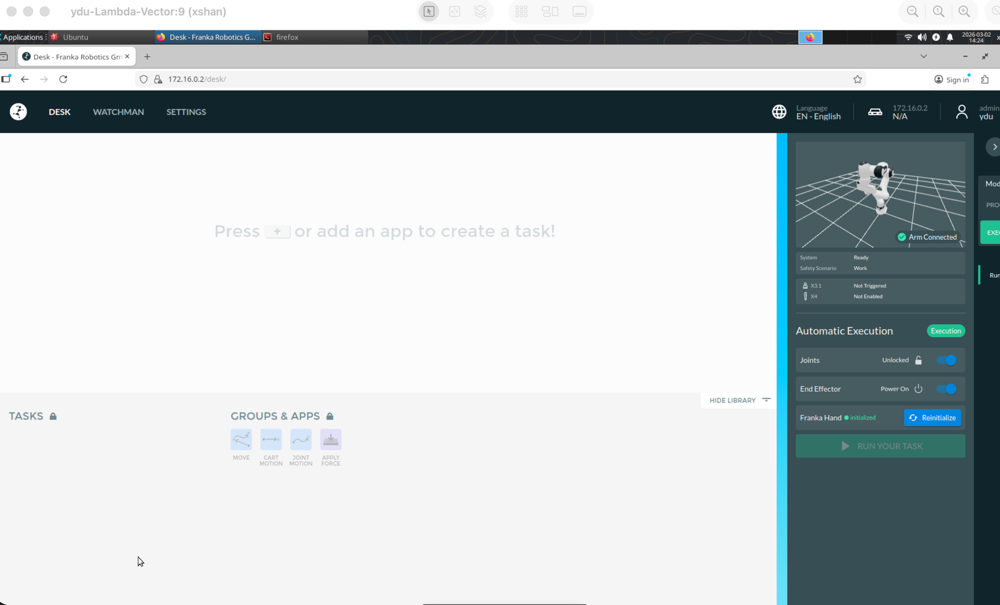
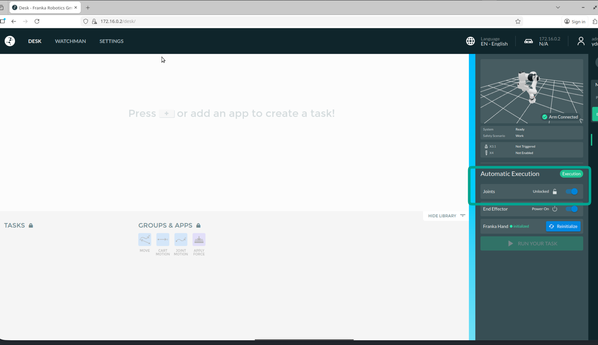
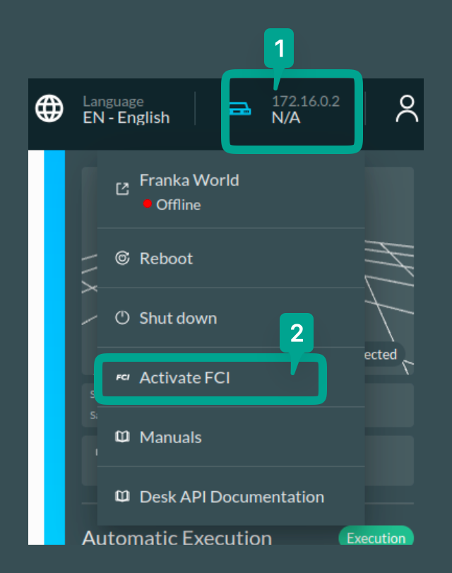

# Robot Instructions

## Teleop Franka with iPhone

These instructions describe how to start iPhone teleoperation for the Franka arms through the robot workstation. The original Notion page is [Teleop Franka with iPhone](https://app.notion.com/p/hxs1/Teleop-Franka-with-iPhone-317c08dfaedc8090a762ef4e5fbaa8ba).

## Safety Checklist

Before enabling teleoperation:

1. Keep one operator next to the robot with access to the emergency stop.
2. Clear the robot workspace and keep people outside the arm's reachable area.
3. Confirm which arm you are controlling before starting the Docker container.
4. Start with slow, small phone motions and stop immediately if the robot moves unexpectedly.

## Robot Hosts

| Item | Address |
| --- | --- |
| Robot workstation / VNC host | `10.250.180.205` |
| Right Franka arm | `172.16.0.2` |
| Left Franka arm | `172.16.1.2` |
| iPhone teleop web client | `10.250.180.205:5000` |

Credentials are shared privately in the lab Slack / private credential notes. Do not commit plaintext passwords to this repository.

## 1. Connect to the Workstation with VNC

Connect to `10.250.180.205` over VNC.

On macOS, you can use the built-in Screen Sharing app:

```text
Host: 10.250.180.205:5907
```

## 2. Unlock the Robot and Activate FCI

Open Firefox on the workstation:

```bash
firefox
```

Open the dashboard for the arm you want to control:

```text
http://172.16.0.2  # right arm
http://172.16.1.2  # left arm
```

Log in with the robot dashboard credentials from the private credential notes.



Click **Unlock** and wait several seconds. The robot may move slightly while it unlocks.



Activate FCI. The robot light should turn green when FCI is active.



## 3. Install XR Browser on the iPhone

Install [XR Browser](https://apps.apple.com/us/app/xr-browser/id1588029989) on the iPhone.

## 4. Start the Robot Stack

SSH into the workstation as the robot operator account:

```bash
ssh xshan@10.250.180.205
```

Use the private credential notes for the SSH password.

### Right Arm: `172.16.0.2`

Terminal 1:

```bash
cd /home/xshan/droid/
sudo docker compose -f .docker/nuc/docker-compose-nuc-0.18.0.yaml up -d
sudo docker exec -it droid_nuc_0.18.0 bash droid/franka/launch_robot.sh
```

Terminal 2, only if using the Franka gripper:

```bash
sudo docker exec -it droid_nuc_0.18.0 bash droid/franka/launch_gripper.sh
```

Terminal 3:

```bash
cd /home/xshan/tidybot-self
conda activate tidybot-droid
python arm_server.py
```

Terminal 4:

```bash
cd /home/xshan/tidybot-self
conda activate tidybot-droid
export DISPLAY=:9.0
python main_hydra.py experiment=franka_iphone_teleop
```

### Left Arm: `172.16.1.2`

Terminal 1:

```bash
cd /home/xshan/droid/
sudo docker compose -f .docker/nuc/docker-compose-nuc-0.17.0.yaml up -d
sudo docker exec -it droid_nuc_0.17.0 bash droid/franka/launch_robot.sh
```

Terminal 2, only if using the Franka gripper:

```bash
sudo docker exec -it droid_nuc_0.17.0 bash droid/franka/launch_gripper.sh
```

Terminal 3:

```bash
cd /home/xshan/tidybot-self
conda activate tidybot-droid
python arm_server.py
```

Terminal 4:

```bash
cd /home/xshan/tidybot-self
conda activate tidybot-droid
export DISPLAY=:9.0
python main_hydra.py experiment=franka_iphone_teleop
```

## 5. Start iPhone Teleoperation

On the iPhone, connect to the teleop web client in XR Browser:

```text
10.250.180.205:5000
```

The teleoperation flow follows the TidyBot2 client instructions: [Connecting the Client](https://tidybot2.github.io/docs/usage/#connecting-the-client).

1. Align the phone with the robot.
2. Press **Start episode**.
3. To control the arm, hold your thumb on the center of the screen until it turns blue, then move the phone. The arm will track the phone's relative translation and rotation.
4. To control gripper width, slide your thumb up for a wider grip and down for a narrower grip.

## Shutdown

1. Stop teleoperation from the iPhone client.
2. Stop `main_hydra.py`.
3. Stop `arm_server.py`.
4. Stop the gripper process, if it is running.
5. Stop the robot Docker container:

```bash
cd /home/xshan/droid/
sudo docker compose -f .docker/nuc/docker-compose-nuc-0.18.0.yaml down  # right arm
sudo docker compose -f .docker/nuc/docker-compose-nuc-0.17.0.yaml down  # left arm
```

6. Return the robot to a safe state from the Franka dashboard.
